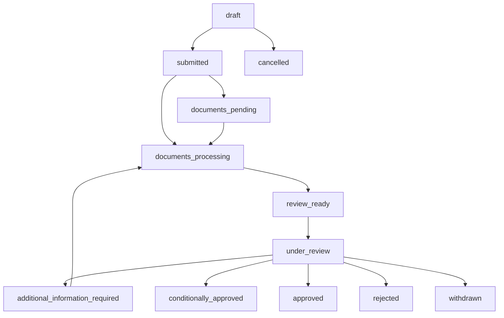
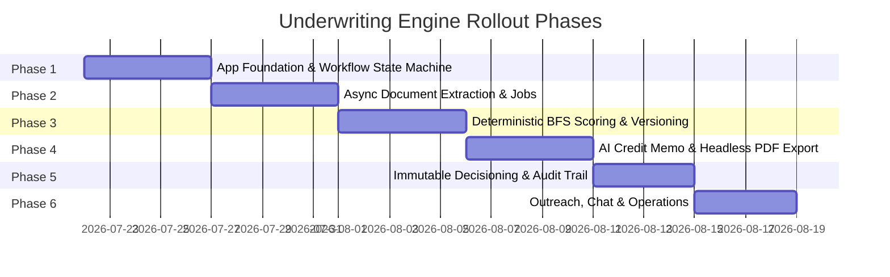

# Zeyro B2B Underwriting Backend API Specification & Architecture (`z-b2b`)

**Version:** 2.1 (Production Hardened Architecture)  
**Date:** July 2026  
**Target Module:** `internal/underwriting/` inside `z-b2b` API (`cmd/api/main.go`)  
**Base Route:** `/api/v1/underwriting`  
**Spec Reference:** `Zeyro_Underwriting_Spec_v2.docx`, `BFS_ONBOARDING_API.md`

---

## 1. Architectural Overview & Design Principles

The **Zeyro B2B Underwriting Engine** is designed as a modular sub-system inside `internal/underwriting` of `cmd/api/main.go` in `z-b2b`. It enforces strict boundaries to allow extraction into a standalone microservice when independent scaling is required.

```text
cmd/api/main.go
internal/
├── underwriting/
│   ├── handler.go              # HTTP handlers & request validation
│   ├── service.go              # Core orchestration service
│   ├── repository.go           # Data access interface
│   ├── workflow.go             # Application state machine & transitions
│   ├── bfs_service.go          # Deterministic, versioned BFS scoring engine
│   ├── memo_service.go         # AI Credit Memo generator & citation verifier
│   ├── document_service.go     # Findoc & Account Aggregator document extraction
│   ├── decision_service.go     # Immutable append-only audit & override engine
│   └── outreach_service.go     # Integrated chat & auto-outreach trigger
├── domain/
│   └── underwriting.go         # Strongly-typed domain models & state definitions
└── repository/postgres/
    ├── queries/underwriting.sql
    └── generated/
```

### Core Design Principles:
1. **Integrated `z-b2b` Monomodule First:** Mounted under `/api/v1/underwriting` within `cmd/api/main.go`.
2. **Async Document & Sync Job Processing:** All Findoc OCR, AA fetching, score recalculation, and PDF generation run asynchronously via a `processing_jobs` queue and `outbox_events` transactional outbox.
3. **Headless Browser PDF Exports:** Credit Memo PDFs generated via Playwright/Chromium HTML rendering with citation chips, page headers, footers, and RBI compliance styling.
4. **Deterministic & Versioned BFS Engine:** BFS scores are **100% deterministic** (`0.35 × ATP + 0.30 × RPS + 0.20 × BCS + 0.15 × FDS` on a 0–100 scale). AI models (LLMs) ONLY consume and summarize scores—they NEVER calculate or alter financial ratios or scores.
5. **Multi-Tenancy & Fine-Grained RBAC:** Every record contains `tenant_id UUID NOT NULL`, `created_by`, and `assigned_to`. 6 distinct roles manage permissions.
6. **Immutable Decision Audit:** `decision_logs` is append-only with cryptographic hash chaining (`previous_event_hash`, `event_hash`) for regulatory compliance.

---

## 2. Multi-Tenancy, RBAC & State Machine

### 2.1 Role-Based Access Control (RBAC)
- **`underwriting_viewer`**: Read-only view of pipeline, documents, score, and credit memo.
- **`credit_officer`**: Assigned file management, document requests, memo section edits, conditional decision submission.
- **`senior_credit_officer`**: Policy override approval, high-value decision approval, score recalculation triggers.
- **`credit_manager`**: Officer assignment, workload re-balancing, conditions tracking management.
- **`risk_admin`**: BFS policy threshold editing, rules configuration, RBI audit export.
- **`tenant_admin`**: Tenant configuration, API credentials, webhook integrations.

### 2.2 Application State Machine (`workflow.go`)



```go
var AllowedTransitions = map[ApplicationStage][]ApplicationStage{
	StageDraft:                          {StageSubmitted, StageCancelled},
	StageSubmitted:                      {StageDocumentsPending, StageDocumentsProcessing},
	StageDocumentsPending:              {StageDocumentsProcessing},
	StageDocumentsProcessing:           {StageReviewReady},
	StageReviewReady:                    {StageUnderReview},
	StageUnderReview:                    {StageAdditionalInformationRequired, StageConditionallyApproved, StageApproved, StageRejected, StageWithdrawn},
	StageAdditionalInformationRequired: {StageDocumentsProcessing},
}
```
*Note: Every transition automatically writes an audit record to `application_timeline` and emits an outbox event.*

---

## 3. Comprehensive Database Schema (`0007_underwriting_schema.sql`)

```sql
-- 1. Core Applications
CREATE TABLE applications (
    id UUID PRIMARY KEY DEFAULT gen_random_uuid(),
    tenant_id UUID NOT NULL,
    app_number VARCHAR(64) NOT NULL UNIQUE,
    applicant_name VARCHAR(255) NOT NULL,
    entity_type VARCHAR(32) NOT NULL, -- 'individual', 'corporate'
    segment VARCHAR(32) NOT NULL,     -- 'salaried', 'self_employed', 'msme', 'gig'
    loan_amount NUMERIC(15, 2) NOT NULL,
    tenure_months INT NOT NULL,
    stage VARCHAR(32) NOT NULL,
    status VARCHAR(32) NOT NULL,
    assigned_to UUID,
    created_by UUID NOT NULL,
    created_at TIMESTAMPTZ NOT NULL DEFAULT NOW(),
    updated_at TIMESTAMPTZ NOT NULL DEFAULT NOW()
);

-- 2. Application Parties & Financials (Typed Columns)
CREATE TABLE application_financials (
    id UUID PRIMARY KEY DEFAULT gen_random_uuid(),
    application_id UUID NOT NULL REFERENCES applications(id),
    gross_monthly_income NUMERIC(15,2),
    existing_emi_obligations NUMERIC(15,2),
    declared_net_worth NUMERIC(15,2),
    aa_inflow_avg NUMERIC(15,2),
    cibil_score INT,
    created_at TIMESTAMPTZ DEFAULT NOW()
);

-- 3. Document Lineage & Extraction (Bounding-Box Coordinates)
CREATE TABLE documents (
    id UUID PRIMARY KEY DEFAULT gen_random_uuid(),
    tenant_id UUID NOT NULL,
    application_id UUID NOT NULL REFERENCES applications(id),
    doc_type VARCHAR(64) NOT NULL,
    source VARCHAR(64) NOT NULL, -- 'aa_feed', 'cibil_api', 'findoc_upload'
    status VARCHAR(32) NOT NULL, -- 'verified', 'analysing', 'missing', 'flagged'
    file_url VARCHAR(512),
    created_at TIMESTAMPTZ DEFAULT NOW()
);

CREATE TABLE document_versions (
    id UUID PRIMARY KEY DEFAULT gen_random_uuid(),
    document_id UUID NOT NULL REFERENCES documents(id),
    version_number INT NOT NULL,
    file_hash VARCHAR(64) NOT NULL,
    created_at TIMESTAMPTZ DEFAULT NOW()
);

CREATE TABLE extracted_fields (
    id UUID PRIMARY KEY DEFAULT gen_random_uuid(),
    document_id UUID NOT NULL REFERENCES documents(id),
    document_version_id UUID NOT NULL REFERENCES document_versions(id),
    field_key VARCHAR(128) NOT NULL,
    field_value TEXT NOT NULL,
    confidence_score NUMERIC(5,4) NOT NULL,
    page_number INT NOT NULL,
    bounding_box JSONB, -- {"x": 0.21, "y": 0.43, "width": 0.19, "height": 0.04}
    extraction_method VARCHAR(64) NOT NULL, -- 'findoc', 'aa'
    extraction_version VARCHAR(32) NOT NULL,
    created_at TIMESTAMPTZ DEFAULT NOW()
);

-- 4. Flags & Consequence Explanation
CREATE TABLE flags (
    id UUID PRIMARY KEY DEFAULT gen_random_uuid(),
    application_id UUID NOT NULL REFERENCES applications(id),
    document_id UUID REFERENCES documents(id),
    flag_type VARCHAR(64) NOT NULL,
    severity VARCHAR(16) NOT NULL, -- 'info', 'warning', 'critical'
    title VARCHAR(255) NOT NULL,
    consequence_description TEXT NOT NULL,
    downstream_impact JSONB,
    is_resolved BOOLEAN DEFAULT FALSE,
    created_at TIMESTAMPTZ DEFAULT NOW()
);

-- 5. Deterministic & Versioned BFS Engine
CREATE TABLE bfs_policy_versions (
    id UUID PRIMARY KEY DEFAULT gen_random_uuid(),
    policy_code VARCHAR(64) NOT NULL,
    policy_version VARCHAR(32) NOT NULL,
    rules_config JSONB NOT NULL,
    is_active BOOLEAN DEFAULT TRUE,
    created_at TIMESTAMPTZ DEFAULT NOW()
);

CREATE TABLE bfs_scores (
    id UUID PRIMARY KEY DEFAULT gen_random_uuid(),
    application_id UUID NOT NULL REFERENCES applications(id),
    engine_version VARCHAR(32) NOT NULL,
    policy_version VARCHAR(32) NOT NULL,
    composite_score INT NOT NULL, -- 0 to 100
    risk_tier VARCHAR(16) NOT NULL,
    atp_score INT NOT NULL,
    rps_score INT NOT NULL,
    bcs_score INT NOT NULL,
    fds_score INT NOT NULL,
    monthly_surplus NUMERIC(15,2),
    max_recommended_emi NUMERIC(15,2),
    input_snapshot JSONB NOT NULL,
    calculated_at TIMESTAMPTZ DEFAULT NOW()
);

-- 6. AI Credit Memos & Citations
CREATE TABLE credit_memos (
    id UUID PRIMARY KEY DEFAULT gen_random_uuid(),
    application_id UUID NOT NULL REFERENCES applications(id),
    version_number INT NOT NULL,
    executive_summary TEXT,
    financial_analysis TEXT,
    risk_assessment TEXT,
    recommendation VARCHAR(64),
    llm_model_version VARCHAR(64),
    created_at TIMESTAMPTZ DEFAULT NOW()
);

CREATE TABLE credit_memo_citations (
    id UUID PRIMARY KEY DEFAULT gen_random_uuid(),
    credit_memo_id UUID NOT NULL REFERENCES credit_memos(id),
    claim_text TEXT NOT NULL,
    document_id UUID NOT NULL REFERENCES documents(id),
    extracted_field_id UUID REFERENCES extracted_fields(id),
    page_number INT,
    bounding_box JSONB
);

-- 7. Immutable Decision Audit Log (Cryptographic Hash)
CREATE TABLE decision_logs (
    id UUID PRIMARY KEY DEFAULT gen_random_uuid(),
    tenant_id UUID NOT NULL,
    application_id UUID NOT NULL REFERENCES applications(id),
    officer_id UUID NOT NULL,
    officer_role VARCHAR(64) NOT NULL,
    ai_recommendation VARCHAR(64) NOT NULL,
    final_decision VARCHAR(64) NOT NULL,
    override_reason_code VARCHAR(64), -- 'relationship_history', 'additional_collateral', etc.
    override_justification TEXT,
    source_ip VARCHAR(45) NOT NULL,
    request_id VARCHAR(128) NOT NULL,
    previous_event_hash VARCHAR(64),
    event_hash VARCHAR(64) NOT NULL,
    created_at TIMESTAMPTZ DEFAULT NOW()
);

-- 8. Processing Jobs & Transactional Outbox
CREATE TABLE processing_jobs (
    id UUID PRIMARY KEY DEFAULT gen_random_uuid(),
    tenant_id UUID NOT NULL,
    application_id UUID NOT NULL REFERENCES applications(id),
    job_type VARCHAR(64) NOT NULL, -- 'aa_sync', 'findoc_extraction', 'bfs_recalc', 'pdf_export'
    status VARCHAR(32) NOT NULL,   -- 'queued', 'processing', 'completed', 'failed'
    retry_count INT DEFAULT 0,
    error_message TEXT,
    payload JSONB,
    created_at TIMESTAMPTZ DEFAULT NOW(),
    updated_at TIMESTAMPTZ DEFAULT NOW()
);

CREATE TABLE outbox_events (
    id UUID PRIMARY KEY DEFAULT gen_random_uuid(),
    aggregate_type VARCHAR(64) NOT NULL,
    aggregate_id VARCHAR(64) NOT NULL,
    event_type VARCHAR(64) NOT NULL,
    payload JSONB NOT NULL,
    processed_at TIMESTAMPTZ
);
```

---

## 4. REST API Endpoint Specifications

All mutating endpoints require `Idempotency-Key` and `X-Request-ID` headers.

### 4.1 Application Management & Workflow

#### `GET /api/v1/underwriting/applications`
Fetch application pipeline with pagination and filtering.

#### `GET /api/v1/underwriting/applications/{id}`
Fetch application header, stage status, and BFS summary.

#### `POST /api/v1/underwriting/applications/{id}/assign`
Assign or reassign application file to a credit officer.

#### `GET /api/v1/underwriting/applications/{id}/timeline`
Fetch immutable application stage transition timeline and audit logs.

---

### 4.2 Document Intelligence & Async Jobs

#### `POST /api/v1/underwriting/applications/{id}/documents/sync`
Trigger async Account Aggregator & Findoc document fetch job.

**Response `202 Accepted`:**
```json
{
  "jobId": "job_981247",
  "applicationId": "app_98124712",
  "status": "queued",
  "jobType": "aa_sync",
  "createdAt": "2026-07-21T09:40:00Z"
}
```

#### `GET /api/v1/underwriting/applications/{id}/processing-jobs`
Check status of active processing jobs (OCR, BFS recalculation, PDF export).

#### `GET /api/v1/underwriting/documents/{id}/viewer`
Fetch PDF URL, extracted fields with bounding-box coordinates, and AA vs Findoc cross-validation gap.

---

### 4.3 Deterministic BFS Engine & Policy Versioning

#### `GET /api/v1/underwriting/applications/{id}/bfs-score`
Fetch deterministic score, component breakdown, surplus calculation, and signal citations.

#### `POST /api/v1/underwriting/applications/{id}/bfs-score/recalculate`
Enqueue async score re-computation job.

#### `GET /api/v1/underwriting/applications/{id}/bfs-score/history`
Fetch versioned history of BFS score calculations for an application.

---

### 4.4 AI Credit Memo & Headless PDF Export

#### `GET /api/v1/underwriting/applications/{id}/credit-memo`
Fetch latest versioned credit memo with verified source citations.

#### `POST /api/v1/underwriting/applications/{id}/credit-memo/generate`
Enqueue AI Credit Memo generation job.

#### `POST /api/v1/underwriting/applications/{id}/credit-memo/export`
Trigger Playwright headless PDF generation job.

**Response `202 Accepted`:**
```json
{
  "jobId": "job_pdf_8819",
  "status": "processing",
  "downloadUrl": null
}
```

---

### 4.5 Immutable Decision Audit & Overrides

#### `POST /api/v1/underwriting/applications/{id}/decision`
Submit final underwriting decision (Approve, Approve with Conditions, Reject, Escalate).

**Request Schema:**
```json
{
  "decision": "approved_with_conditions",
  "overrideReasonCode": "verified_external_income",
  "overrideJustification": "Officer verified cash sales offset the AA income gap.",
  "conditions": [
    "Submit March 2026 bank statement",
    "Provide written clarification for ITR income variance"
  ]
}
```

#### `GET /api/v1/underwriting/applications/{id}/decision-log`
Fetch immutable append-only decision audit log with cryptographic hash verification.

---

## 5. Phased Implementation Roadmap



1. **Phase 1 — Application Foundation:** Schema migration, workflow state machine, tenant isolation, RBAC, assignment, and timeline tracking.
2. **Phase 2 — Document Intelligence:** Async job queue (`processing_jobs`), Findoc/AA adapters, extracted fields with bounding boxes, flags engine, and SSE outbox streaming.
3. **Phase 3 — BFS Scoring:** Normalized scoring engine (`0.35 ATP + 0.30 RPS + 0.20 BCS + 0.15 FDS`), deterministic policy versioning, and score history tracking.
4. **Phase 4 — AI Credit Memo:** LLM context builder, JSON output validation, strict citation verification, section edit modal, Playwright headless PDF generation.
5. **Phase 5 — Immutable Decision Audit:** Append-only decision log with cryptographic hash verification, override reason codes, conditions tracker, and RBI format audit export.
6. **Phase 6 — Operations & Outreach:** Integrated applicant chat, missing document auto-outreach, team workload rebalancing, and agent execution logs.

---

## 6. Frontend Feature-Based UI Component Architecture (`src/components/`)

*(Maintained and modularized as detailed in Section 6 of `UNDERWRITING_API_SPEC.md`)*
